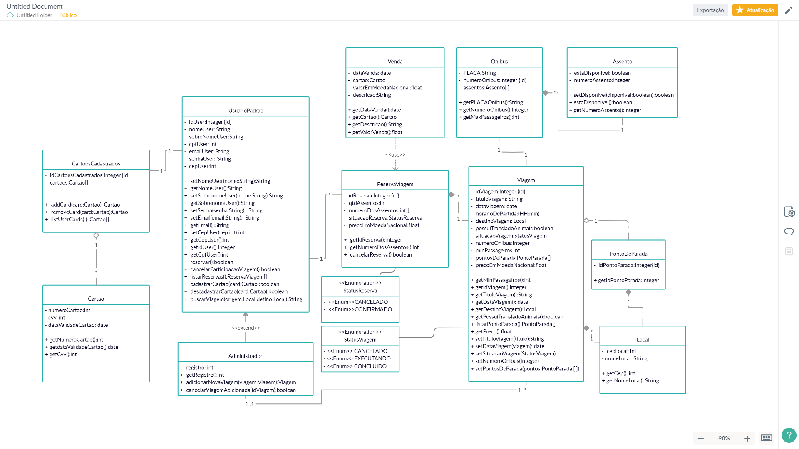
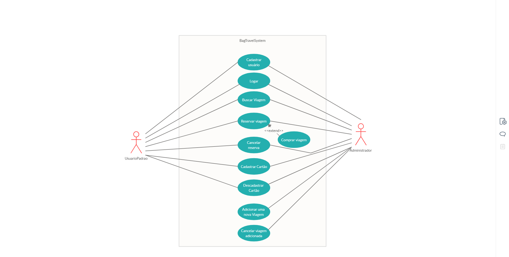

# [Projeto Bag Travel] 

### [Modelagem de Software - Desenvolvido por:] 
* Gabriel Gustavo M. da Silva 
* Guilherme Manzano
* Jordan Gouveia
* Leonardo Pereira 

============================================= 
* Ciência da Computação - 2019. UnicSul.

Esse projeto foi desenvolvido com base em aplicações de reservas de passagens. Sua Modelagem foi feita com base nos mockups [desenvolvidos por: ]

* Leonardo Espadilha
* Bruno Garutti

============================================= 
##  Discplina: Engenharia de Software.
##  Professor:  Me Geiza Caruline Costa.

## Diagramas:

* Classe:

* Casos de uso:

[Cenario de casos de uso](./cenarioDeCasosDeUso.pdf)
