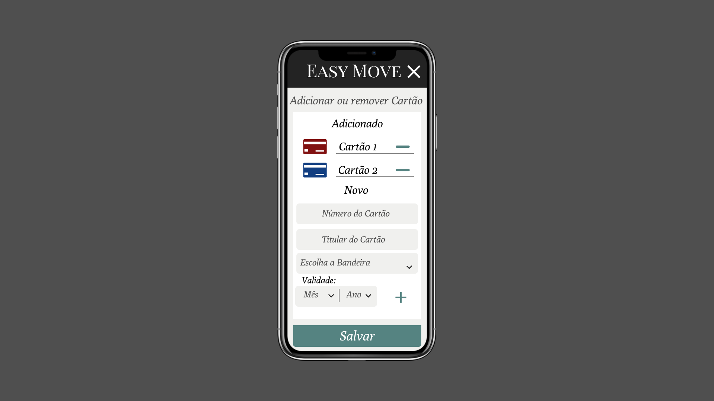

# [Projeto Easy Move] 
* Ciência da Computação - 2019, UnicSul

## [Desenvolvido por:] - Gabriel Gustavo M. da Silva (Mockups e Engeharia de Requistos) e Dennis Algusto. ( Engeharia de Requistos)  

[Projeto Easy Move] -  Esse projeto foi desenvolvido com base em aplicações de reservas de passagens. 

##  Discplina: Engenharia de Software.
##  Professor:  Me Geiza Caruline Costa.
============================================= 

## Mockups - Versão Mobile

* Home:

* Login:

* Cadastro:

* Recuperar Senha:

* Página Inicial:

* Menu:

* Alterar Moeda:

* Adicionar ou Remover Cartão:

* Editar Perfil:

* Trocar Senha:

* Minhas Viagens:

* Resultado busca:

* Confirmar Reserva:

============================================= 

## Mockups - Versão Web

* Home:

* Login:

* Cadastro:

* Recuperar Senha:

* Página Inicial:  

* Editar Perfil:

* Minhas Viagens:

* Resultado Busca:

* Resultado Busca:

